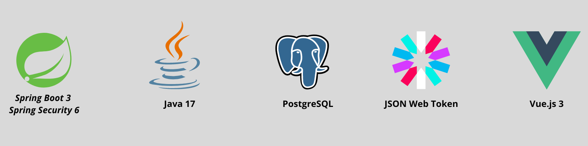
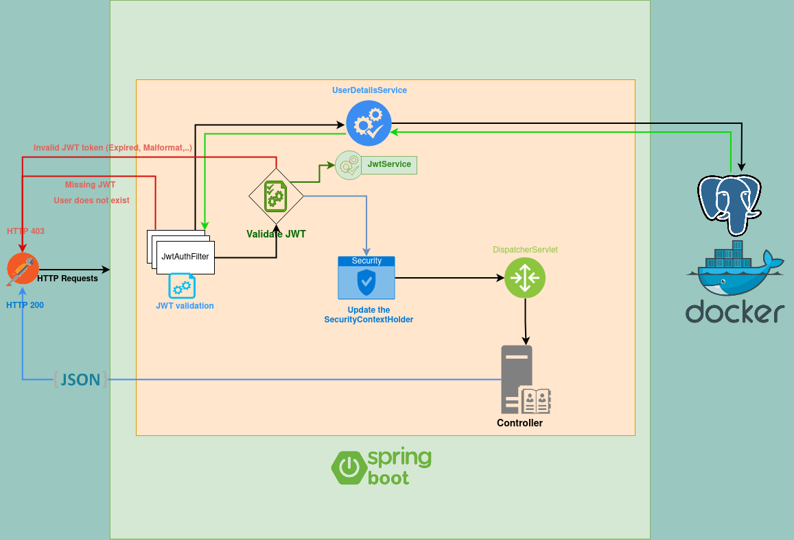
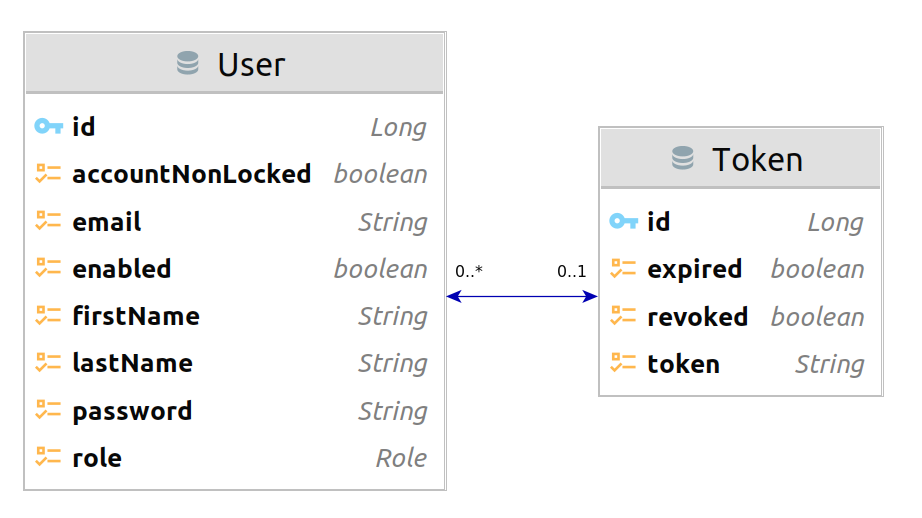

# _Secure Platform with Spring Boot 3, Spring Security 6, PostgreSQL, JWT and Vue.js_

***
**_`Assalaam-Alaikum ---- السَّلامُ عَلَيْكُم ورَحْمَةُ اللهِ وَبَرَكاتُهُ`_** <br/>

Welcome to the **_`Secure Platform with Spring Boot 3, Spring Security 6, PostgreSQL, JWT and Vue.js`_** project. <br/>
This project is a secure platform designed for user registration, login, and password restoration. It is built using a
combination of Spring Boot, Spring Security, PostgreSQL, JWT (JSON Web Tokens), and Vue.js.

## Introduction

In today's digital world, ensuring the security of user information is of utmost importance. This platform provides a
robust and reliable solution for managing user authentication and access control. Whether you are developing a web
application, a mobile app, or any system that requires user management, this project provides a solid foundation.

## _Table of Content_

* [_Secure Platform with Spring Boot 3, Spring Security 6, PostgreSQL, JWT and Vue.js_](#secure-platform-with-spring-boot-3-spring-security-6-postgresql-jwt-and-vuejs )
    * [_Technologies Used_](#technologies-used)
    * [_Requirements_](#requirements)
    * [_Installation_](#installation)
    * [_Architecture_](#architecture)
    * [_Endpoints_](#endpoints)
    * [_Screen Shots_](#Screen-Shots)
    * [_Contributing_](#contributing)
    * [_License_](#license)

## _Technologies Used_

Those are the main technologies used in this project:


The following are in details technologies used to build this application: <br/>
✅ Java 17 <br/>
✅ Spring Boot 3 <br/>
✅ Spring Security 6 <br/>
✅ Spring Data JPA <br/>
✅ Docker <br/>
✅ PostgreSQL <br/>
✅ JUnit <br/>
✅ Mockito <br/>
✅ JWT <br/>
✅ Vue.js <br/>
✅ Vue router <br/>
✅ Pinia <br/>

## _Requirements_

* Having **Java 17** or later installed. <br>
  You can download it
  from [Oracle's website](https://www.oracle.com/java/technologies/javase/jdk17-archive-downloads.html).


* Having **PostgreSQL** DataBase installed, or you can fire up an instance of PostgreSQL using the docker-compose file
  provided in the
  project. <br>
  Install **PostgreSQL** from [PostgreSQL's website](https://www.postgresql.org/download/).


* Having **Node.js** installed. <br>
  You can download it from [Node.js's website](https://nodejs.org/en/download/).

## _Installation_

1. Clone this repository to your local machine using this
   command : <br/> `git clone https://github.com/NidhalNaffati/SpringSecurity_SpringBoot6_Vue3_JWT.git`
2. Import the project into your IDE.
3. Open the `application.yml` file located in `src/main/resources/` and update the database credentials with your own.

  ```yaml
spring:
  datasource:
    url: jdbc:postgresql://${DB_URL} # by default, the url is localhost:5432
    username: ${DB_USERNAME} # by default, the username is postgres
    password: ${DB_PASSWORD} 
```

4. Run the backend via your IDE, or using the Maven plugin `mvn spring-boot:run`.
5. Run the frontend via your IDE, or using the following command `npm run dev`.

## _Architecture_

Diagram of the architecture of the application:



Diagram of class of the application:



## _Endpoints_

After running the application, you can use Postman to communicate with the REST API endpoints.
Each endpoint expects a specific input format and returns a specific output format.
If you want to **test** it out in **Postman**, you can import the collections located in `src/test/postman/`

The following endpoints are available in the API:

### Public endpoints that do not require authentication:

| HTTP Method | Endpoint                       |               Request Body                |      Response Body       |                                            Exception(s)                                             | Authorization Header | Description                                                          |
|:-----------:|--------------------------------|:-----------------------------------------:|:------------------------:|:---------------------------------------------------------------------------------------------------:|:--------------------:|----------------------------------------------------------------------|
|   `POST`    | `/api/v1/auth/register`        |             `RegisterRequest`             |         `String`         | `PasswordDontMatchException`<br>`EmailAlreadyExistsException`<br>`MailSendException`<br>`Exception` |          -           | Registers a new user.                                                |
|   `POST`    | `/api/v1/auth/authenticate`    |          `AuthenticationRequest`          | `AuthenticationResponse` |                                                  -                                                  |          -           | Authenticates a user and returns an authentication token.            |
|   `POST`    | `/enable-user/{token}`         |                 `String`                  |         `String`         |                   `ExpiredJwtException`<br>`UserNotFoundException`<br>`Exception`                   |          -           | Enables a user account with the provided activation token.           |
|   `POST`    | `/api/v1/auth/refresh-token`   | `HttpServletRequest, HttpServletResponse` | `AuthenticationResponse` |                                                  -                                                  |   `Bearer {token}`   | Refreshes the authentication token for the current user.             |
|   `POST`    | `/api/v1/auth/forgot-password` |              `EmailRequest`               |         `String`         |                    `UserNotFoundException`<br>`MailSendException`<br>`Exception`                    |          -           | Sends a reset password link to the user's email.                     |
|   `POST`    | `/api/v1/auth/reset-password`  |          `UpdatePasswordRequest`          |         `String`         |   `PasswordDontMatchException`<br>`ExpiredJwtException`<br>`UserNotFoundException`<br>`Exception`   |          -           | Resets the user's password with the provided token and new password. |

<br/>

### Endpoints that require authentication:

| HTTP Method | Endpoint        | Request Body | Response Body | Authorization Header | Exception(s)            | Description                   |
|:-----------:|-----------------|:------------:|:-------------:|:--------------------:|-------------------------|-------------------------------|
|    `GET`    | `/api/v1/admin` |      -       |   `String`    |   `Bearer {token}`   | `AccessDeniedException` | Return a message for an admin |
|    `GET`    | `/api/v1/user`  |      -       |   `String`    |   `Bearer {token}`   | `AccessDeniedException` | Return a message for a user   |

<br/>

## _Screen Shots_

## _Contributing_

1. Fork this repository to your GitHub account.
2. Clone the forked repository to your local machine.
3. Create a new branch for your changes.
4. Make your changes and commit them with descriptive commit messages.
5. Push your changes to your GitHub account.
6. Create a pull request from your branch to the original repository's main branch.
7. Wait for the maintainers to review and merge your changes.

When making contributions, please keep the following in mind:

* Follow the code style and formatting guidelines used in the project.
* Write clear and concise commit messages that explain the changes you made.
* Make sure your changes do not break existing functionality.
* Write tests for new code and ensure that all existing tests pass.

## _License_

You are allowed to use, copy, modify, and distribute the code freely, just don't create a bomb or something like that xD
